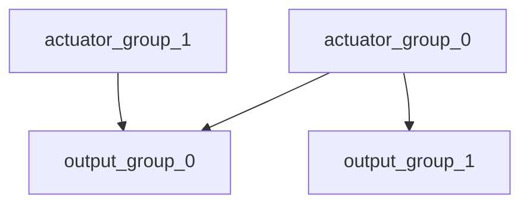

# Mixing and Actuators

The PX4 architecture ensures that the airframe layout does not require special case handling in the core controllers.

Mixing means to take force commands (e.g. `turn right`) and translate them to actuator commands which control motors or servos. For a plane with one servo per aileron this means to command one of them high and the other low. The same applies for multicopters: Pitching forward requires changing the speed of all motors.

Separating the mixer logic from the actual attitude controller greatly improves reusability.

## Key Concepts

PX4 uses control groups (inputs) and output groups. Conceptionally they are very simple: A control group is e.g. `attitude`, for the core flight controls, or `gimbal` for payload. An output group is one physical bus, e.g. the first 8 PWM outputs for servos. Each of these groups has 8 normalized (-1..+1) command ports, which can be mapped and sclaled through the mixer. A mixer defines how each of these 8 signals of the controls are connected to the 8 outputs.

For a simple plane control 0 (roll) is connected straight to output 0 (elevator). For a multicopter things are a bit different: control 0 (roll) is connected to all four motors and combined with throttle.

## Mapping

Since there are multiple control groups (like flight controls, payload, etc.) and multiple output groups (first 8 PWM outpus, UAVCAN, etc.), one control group can send command to multiple output groups.

