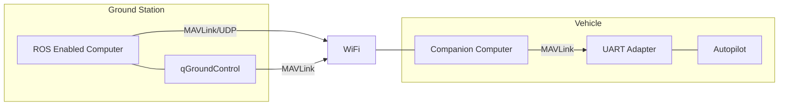

# Hardware setup

Usually, there are three ways of setting up offboard communication.

### 1. Serial radios
1. One connected to a UART port of the autopilot
1. One connected to a ground station computer

Example radios include
* [Lairdtech RM024](http://www.lairdtech.com/products/rm024)
* [Digi International XBee Pro](http://www.digi.com/products/xbee-rf-solutions/modules)

### 2. On-board processor
A small computer mounted onto the vehicle connected to the autopilot through a UART to USB adapter. There are many possibilities here and it will depend on what kind of additional on-board processing you want to do in addition to sending commands to the autopilot.

Small low power examples:
* [Odroid C1+](http://www.hardkernel.com/main/products/prdt_info.php?g_code=G143703355573) or [Odroid XU4](http://www.hardkernel.com/main/products/prdt_info.php?g_code=G143452239825)
* [Raspberry Pi](https://www.raspberrypi.org/)
* [Intel Edison](http://www.intel.com/content/www/us/en/do-it-yourself/edison.html)

Larger high power examples
* [Intel NUC](http://www.intel.com/content/www/us/en/nuc/overview.html)
* [Gigabyte Brix](http://www.gigabyte.com/products/list.aspx?s=47&ck=104)
* [Nvidia Jetson TK1](https://developer.nvidia.com/jetson-tk1)

### 3. On-board processor and wifi link to ROS (***Recommended***)
A small computer mounted onto the vehicle connected to the autopilot through a UART to USB adapter while also having a WiFi link to a ground station running ROS. This can be any of the computers from the above section coupled with a WiFi adapter. For example, the Intel NUC D34010WYB has a PCI Express Half-Mini connector which can accomodate an [Intel Wifi Link 5000](http://www.intel.com/products/wireless/adapters/5000/) adapter.

