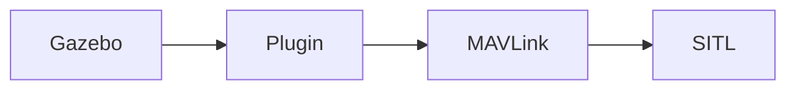

# Gazebo Simulation

[Gazebo](http://gazebosim.org) is a 3D simulation environment for autonomous robots. It can be used with [ROS as complete robotics simulation suite](https://pixhawk.org/dev/ros/sitl) or standalone, and this guide covers the simpler to set up standalone operation.



## Installation

The installation requires to install Gazebo and our simulation plugin.

<aside class="tip">
Mac OS users should install gazebo7 (not 6). Linux users: If you installed a ROS version earlier than Jade, be sure to uninstall the bundled Gazebo (sudo apt-get remove ros-indigo-gazebo) version as it is too old.
</aside>

Follow the instruction in the [sitl_gazebo documentation](https://github.com/px4/sitl_gazebo) to install. Binaries are available for all major operating systems and can be installed via `apt-get` or `brew`.

## Running the Simulation

Run the PX4 SITL with the Iris configuration in the Firmware directory:

<div class="host-code"></div>

```sh
cd ~/src/Firmware
make posix_sitl_default gazebo
```

This will bring up the PX4 shell:

```sh
[init] shell id: 140735313310464
[init] task name: mainapp

______  __   __    ___ 
| ___ \ \ \ / /   /   |
| |_/ /  \ V /   / /| |
|  __/   /   \  / /_| |
| |     / /^\ \ \___  |
\_|     \/   \/     |_/

Ready to fly.


pxh>
```

<aside class="note">
Right-clicking the quadrotor model allows to enable follow mode from the context menu, which is handy to keep it in view.
</aside>

## Taking it to the Sky


The system will print the home position once it finished intializing (`telem> home: 55.7533950, 37.6254270, -0.00`). You can bring it into the air by typing:

```sh
pxh> commander takeoff
```

<aside class="tip">
Joystick or thumb-joystick support is available through QGroundControl (QGC). To use manual input, put the system in a manual flight mode (e.g. POSCTL, position control). Enable the thumb joystick from the QGC preferences menu.
</aside>
