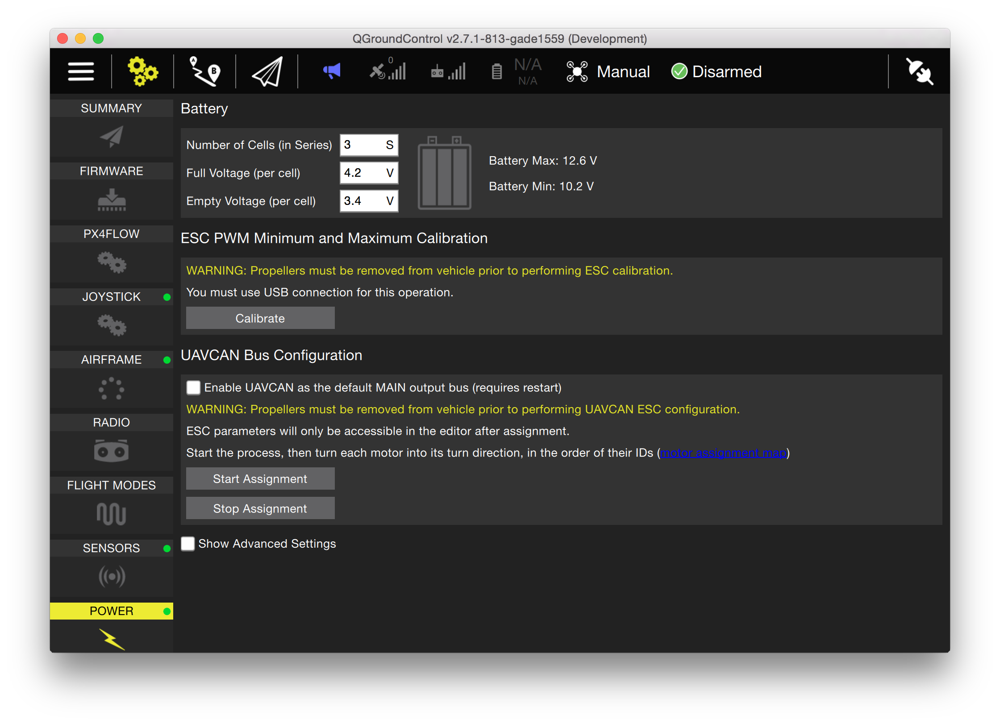

# UAVCAN Enumeration and Configuration

<aside class="todo">
Set the UAVCAN_ENABLE parameter to '3' in the QGroundControl parameter editor and *power cycle* the board to enable CAN motor outputs. Set it to '2' to enable CAN, but leave motor outputs on PWM.
</aside>

Use [QGroundControl](qgroundcontrol-intro.md) and switch to the Setup view. Select the Power Configuration on the left. Click on the UAVCAN configuration start button. The ESCs will all beep each time one is enumerated, and then the enumerated one will restart.

After the first ESC beeps, turn the propeller on it swiftly into the correct turn direction. Repeat this step for all motor controllers. This step has to be performed only once and does not need to be repeated after firmware upgrades.

